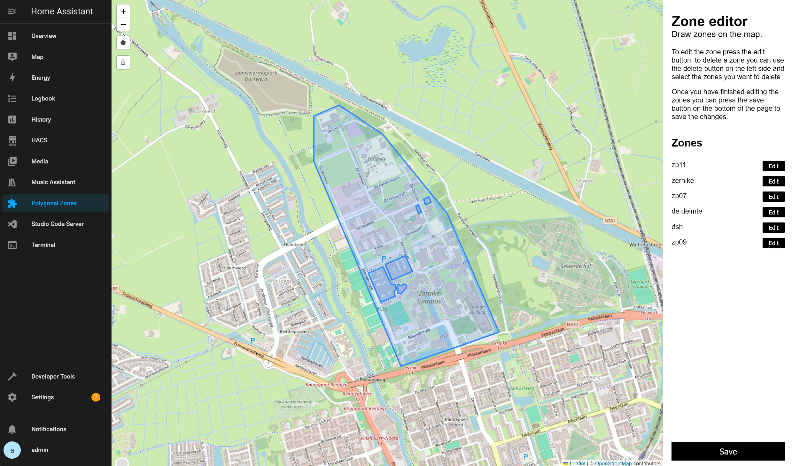
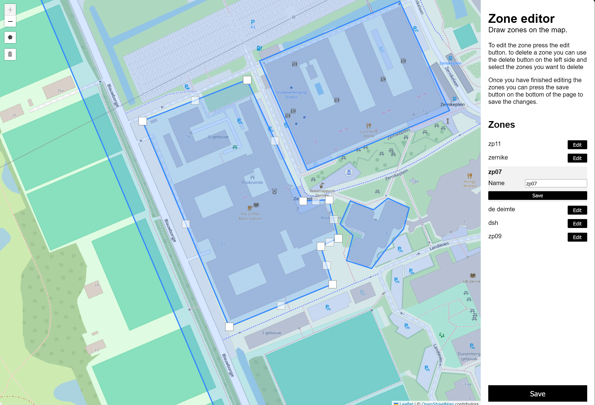
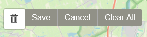

# Polygonal Zones Add-on

This add-on allows you to create and manage polygonal zones within Home Assistant. These zones can then be used for
automations based on location.

[](https://my.home-assistant.io/redirect/supervisor_add_addon_repository/?repository_url=https%3A%2F%2Fgithub.com%2FMichelGerding%2FHomeassistant-polygonal-zones-addon.git)

## Installation

### Prerequisites:

- A running Home Assistant instance with Supervisor enabled.

### Adding the Repository:

1. Click the button above labeled "Add Repository" to automatically add the repository for this add-on.
2. Alternatively, manually add the following repository URL to your Home Assistant Supervisor add-on store:

```
https://github.com/MichelGerding/Homeassistant-polygonal-zones-addon.git
```

### Installing the Add-on:

1. Once the repository is added, navigate to the Supervisor Add-on Store.
2. Find the "Polygonal Zones" add-on and click "Install".

## Configuration

This add-on has only one configuration option: the port on which the web interface is exposed. By default, this is port
**8000**.

## Usage

### Accessing the Web Interface:

1. After installing and starting the add-on, you can access the web interface in two ways:

- Configuration Page: YOu can access the web interface by pressing the `open web ui` button on the info page of the
  add-on.
- Sidebar: You can add the add-on to the sidebar by enabling the `show in sidebar` option in the add-on configuration.

### Saving changes:

- **Important:** Any changes made to the zones need to be saved by pressing the **Save Button** located at the bottom of
  the sidebar. Unsaved changes will not be persisted between restarts.

### Zones File:

- The zones are stored in a file named `zones.json` located at `http(s)://[HOST]:[PORT]/zones.json`.
  The default port is 8000. This file contains the zones stored as a geojson feature collection. this file is meant to
  be used by the integration of the same name. this integration can be found
  here: [Polygonal Zones](https://github.com/MichelGerding/Homeassistant-polygonal-zones-integration):

### Features:

#### Viewing Zones:

- A list of all the zones is displayed in the sidebar.
- The zones are also visualized on the map.

#### Adding Zones:

- Click the Draw Polygon Button (the button with a pentagon icon) located on the right side of the map.
- Click on the map to define the points of the polygon.
- Click on the first point again to complete the polygon.

#### Editing Zones:

- Click the Edit Button next to a zone's name in the sidebar.
- This will make the polygon editable on the map. Drag the points to modify the zone's shape.
- You can also rename the zone directly in the sidebar.
- After editing, press the Save Button next to the zone's name to save the changes.

#### Deleting Zones:

- Click the Delete Button in the toolbar.
- Select the zones you want to delete by clicking on them.
- Click the Clear All Button to delete all zones at once.
- Once you're satisfied with your selection, press the Save Button next to the delete button to confirm the deletion.
  Remember to also press the Save Button in the sidebar to permanently save these changes.
- A screenshot of the delete button is in the screenshots section below.

## Screenshots:

See the screenshots below for a better understanding of the add-on's features.

- Viewing all zones:
  
- Editing a zone:
  
- Delete button and its options:
  

## TODO

- [ ] Improve ui
    - [ ] Make sidebar collapsable
    - [ ] Make sidebar more responsive
    - [ ] Use nicer map
    - [ ] Add support for dark mode
- [ ] Add more features
    - [ ] Add functionality for multiple shaped zones
        - [ ] Add ability to add circular zones
        - [ ] Add ability to add polygons with holes
        - [ ] Add ability to add zones with multiple shapes
    - [ ] Add support for multiple zone files
- [ ] Add testing to the add-on

## Contributing

Contributions are welcome! If you have any suggestions or improvements, please open an issue or submit a pull request.
